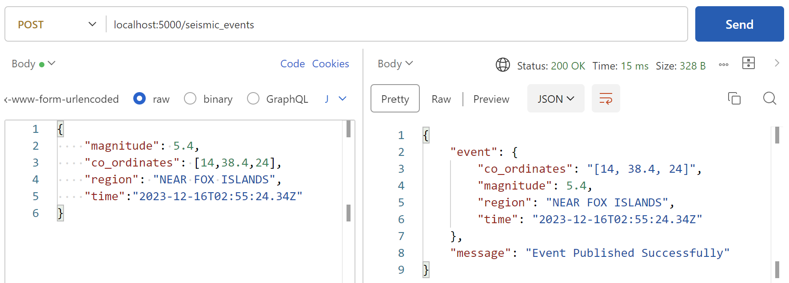
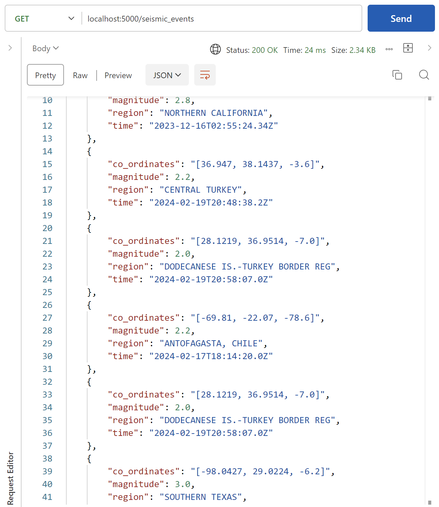

<p align="center">
  <h1 align="center">Seismic Alerts Streamer</h1>

  <p align="center">
    A service that utilizes Apache Kafka to listen & collect data of Realtime Global Seismic events from various Producers and stream them to various Consumer clients that can alert and keep the users updated & safe in Realtime.
    Additionally all micro-services are fully Dockerized, ready to run & be deployed just about anywhere!

  
  
  </p>
</p>

<details open="open">
  <summary>Table of Contents</summary>
  <ol>
    <li>
      <a href="#about-the-project">About The Project</a>
    </li>
    <li><a href="#future-prospects">Future Prospects</a></li>
    <li><a href="#tech-used">Technologies Used</a></li>
    <!-- <li><a href='#in-action'>In Action</a></li> -->
    <li><a href="#getting-started">Getting Started</a>
      <ul>
        <li><a href="#pre-requisites">Pre-requisites</a></li>
        <li><a href="#running-the-project">Running the project</a></li>
      </ul></li>
  </ol>
</details>

<h3 id="about-the-project">• About The Project</h3>

**Seismic Alerts Streamer** at its core, uses Apache Kafka to listen & collect data of Realtime Global Seismic events from Producers and streams them to Consumers.

<p align="center"></p>

All Producers are managed via a Python interface.
**Producers** consists of:
1. A [WebSocket endpoint](https://www.seismicportal.eu/realtime.html) by European-Mediterranean Seismological Centre (EMSC).
2. A Flask Rest API that allows a user to **Report any Seismic Activity around them** (POST) or Fetch log archives from the Database (GET).


<p align="center"><i>Intuitive Error Handling</i></p>

These events are then published to two Kafka topics namely ```minor_seismic_events``` & ```severe_seismic_events``` based on their magnitude.

**Consumers** connected to the Kafka broker, subscribe to these topics and start receiving Seismic Logs. All the consumers are managed via a Multi-threaded Java interface as clients.
Consumers consists of:
1. A Live Log Feed that reads from both topics allowing the user to conveniently view a **Realtime feed of all Seismic Activity around the world**
  


2. A Java SMTP client reads from ```severe_seismic_events``` and Alerts the user of potentially Dangerous Seismic Activity via Email
   


3. A Postgres Database connected directly via a Kafka-JDBC Sink Connector (initialized by the Java interface) conveniently maintains an archive of all Seismic Activity recorded through Kafka.


4. An Interactive Web UI (inspired by EMSC) featuring a Map View of all Seismic Events reading from the Postgres Database via our Rest API.
      


<!-- <h3 id="in-action">• In Action</h3>

- #### Live Feed

  

- #### Web UI
  
  

- #### Email Alerts

  

- #### Database Entries
  - ```minor_seismic_events``` Table

  

  - ```severe_seismic_events``` Table

  

- #### Meaningful Developer Logs

   -->

<h3 id="future-prospects">• Future Prospects</h3>
The overall <b>Goal</b> of the project is to build a portable, efficient and scalable system that can connect various Seismology Providers to various Consumer clients that can serve the users in innovative ways keeping them safe and alerted.

 

Apache Kafka because of its high through-put enables it to scale easily to huge traffic using many brokers & clusters. The Service is further fully Containerized making it ready for deployment.

This Service can also be extended and Scaled by adding more Seismic Data Providers, and Consumer Clients like Mobile Apps & other Safety Protocols and adding Data Analytics Tools to the Web UI.

<h3 id="tech-used">• Technologies Used</h3>

The Project is developed using the following Technologies, Libraries & Frameworks:

- Apache Kafka & Kafka-connect (Confluent)
- Docker
- Python
- Java & Maven
- React.js (Javascript)
- Tornado
- Flask
- Leaflet.js
- PostgreSQL
- JavaMail API & Google SMTP Server
- Shell

<!-- GETTING STARTED -->

<h3 id="getting-started">• Getting Started</h3>

To setup the project locally follow the steps below

- <h4 id="pre-requisites">Pre-requisites:</h4>

  - [Docker](https://docs.docker.com/get-docker/) : Told you.. Its fully Containerized!

- <h4 id="running-the-project">Running the Project:</h4>
  
  - <h4>As a User</h4>
  
  1. **Fork** and **clone** the project to your local system
  2. Set necessary environment variables. Create a ```.env``` file in the root directory and write your Gmail credentials in it for the Gmail SMTP Server. This email will be used to send the Alerts to the users.
  Name them as:

  ```
  SERVICE_EMAIL_ID=john.doe@gmail.com
  SERVICE_EMAIL_PASSWORD=password
  ```

  If you have 2-step Authentication set up for your Google Account, [Create a new app password](https://support.google.com/accounts/answer/185833?visit_id=638381954978806969-3472662555&p=InvalidSecondFactor&rd=1) and use that password in your .env file

  <br>

  3. Now build and run the docker-compose file & ```exec -it``` into the ```consumers``` container.
  To do this, from project directory, run

  ```shell
  docker compose up -d --build   # Build & run the containers
  docker exec -it <containerId_of_consumers> sh   # Attach shell to consumers container
  ``` 

  This should run the following containers


To find the <container_id>, run ```docker ps``` or use Docker Desktop, and copy the container id of container named ```consumers``` or ```seismic-alerts-streamer-consumers```

  <br>

  iv. Once inside the ```consumers``` container's shell, run


  ```shell
  mvn -q exec:java   # Run the maven project
  ``` 
  You have **successfully** entered the program as a user!

  - <h4>Usage of the Rest API</h4>

      The Rest API accessible at ```localhost:5000``` has the following endpoints:
  1. ```POST /seismic_events```: Self-Report Seismic Activity in you region
   
   Request Body should adhere to the given format for a successful submission:
   ```json
   {
    "magnitude":"float",
    "region":"string",
    "time":"ISO-8601 string. Min: YYYY, Max: YYYY-MM-DD(T)hh:mm:ss.ssssss(Zone)",
    "co_ordinates":"array of floats"
   }                                 
   ```

  


  2. ```GET /seismic_events```: Returns entire recorded archive from Database.
   
  

  3. ```GET /seismic_events/minor``` or ```GET seismic_events/severe```: Returns records based on severity of the Seismic activities.

- <h4>For Developers</h4>
  All micro-services are set up with meaningful logs that can help with debugging and further development.

    

  To view log of other containers, run

  ```shell
  docker logs <container_id>
  ```
  If you wish to develop it locally without docker, manually install the [technologies used](#tech-used).
  Run the following commands to install necessary dependencies:

  ```bash
  cd Producers
  pip install -r requirements.txt
  ```
  ```bash
  cd Consumers
  mvn clean install
  ```
  ```bash
  cd Producers/Web
  npm install
  ```

